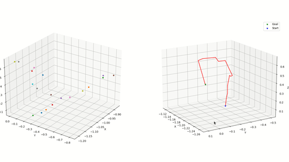

# RRT - Path Planner for 6 DOF Manipulator Arm (URe10)
Conventional RRT path planner optimized to function in URe10 configuration space

## Dependencies
1. python 3
2. numpy
3. matplotlib
4. tqdm
---

## Visualize
<p align="center">
  
</p>
---

## Run Package
```
Run RRT.py
```

Change following call parameters (optional)
```python
rrt = RRT(q_start, q_goal, max_iter=1000, step_size=0.2)
```

---
## Modules 
Package contains following scripts/modules:

- Kinematics Solver
- Arm Config File
- Rapidly exploring Random Tree planner
- Vertex and Path visualizer
---

The DH parameters specified in ArmConfig file can be changed to any other manipulator DH paramaters.

## Tasks
- [x] Conventional RRT
- [x] Bi-directional RRT
- [ ] Path Optimization
- [ ] IK Solver
